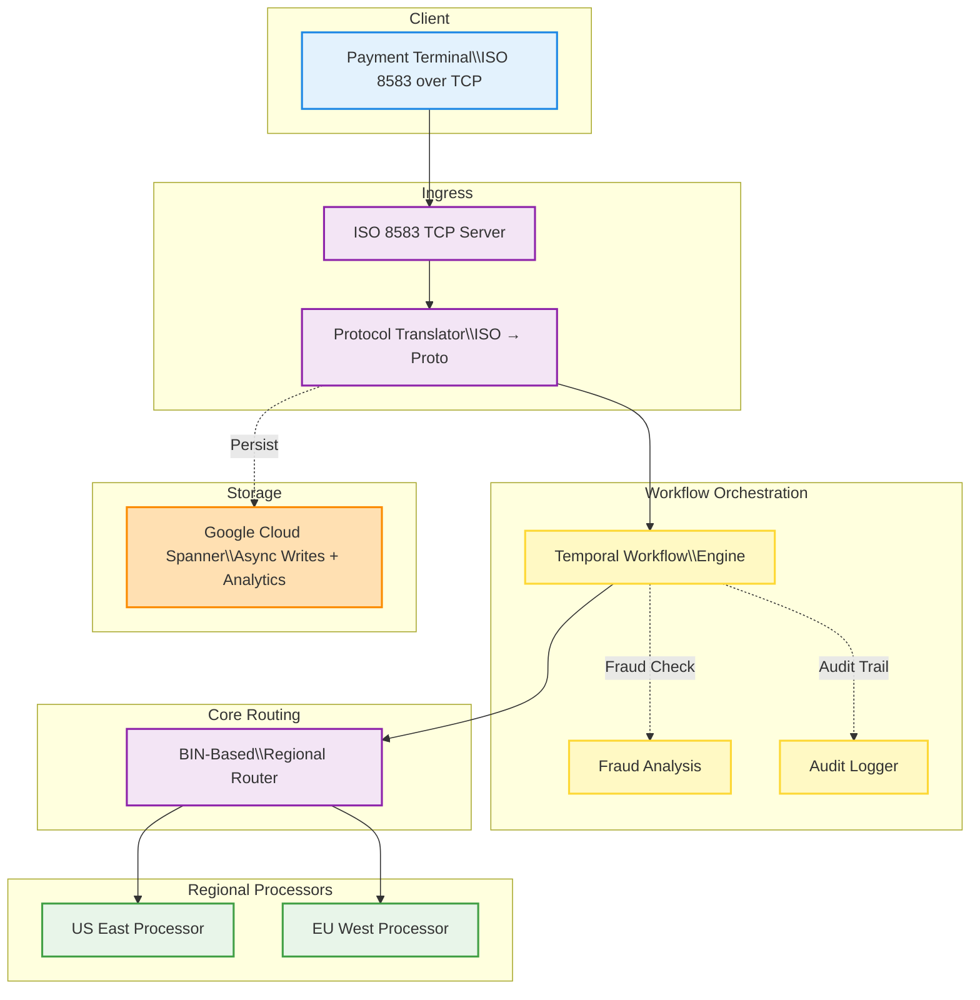
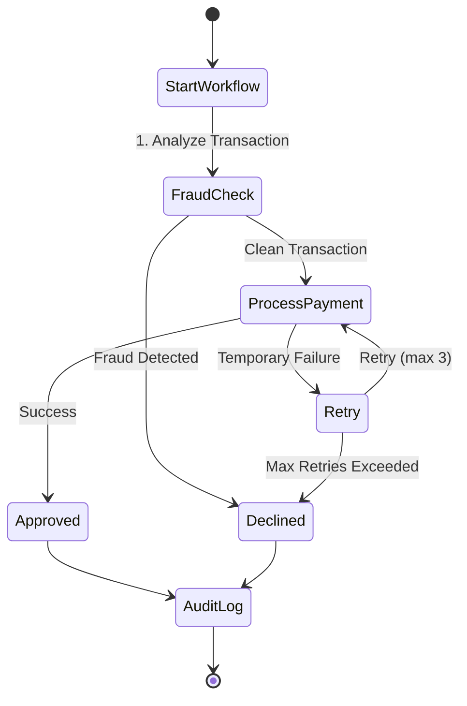
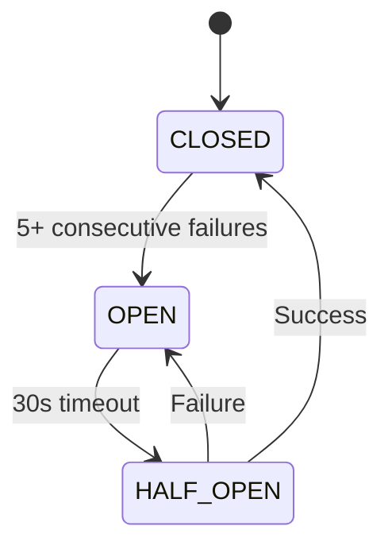

# Pulse

Pulse is a workflow-driven transaction router that processes ISO 8583 messages over TCP, transforms them into protocol buffers, and routes them through Temporal-managed workflows to regional processors—backed by Spanner for global consistency and real-time analytics.

## Overview

Pulse simulates the flow of ISO 8583 messages over TCP from external clients, converts them to gRPC protobuf requests, routes them internally based on BIN ranges, and returns ISO 8583 responses. The system implements modern architectural patterns while maintaining compatibility with legacy payment protocols.

## Key Features

- **ISO 8583 Processing**: TCP server for receiving and responding to financial transaction messages
- **Protocol Transformation**: Converts ISO 8583 messages to Protocol Buffers and back
- **BIN-based Routing**: Routes transactions to different regional processors based on card BIN ranges
- **Multi-Region Architecture**: Supports multiple backend processors (US East and EU West)
- **Fault Tolerance**: Circuit breaker pattern with automatic failover between regions
- **Workflow Orchestration**: Complex transaction flows with Temporal for multi-step processing
- **Fraud Protection**: Real-time fraud monitoring with configurable rules
- **Observability**: Comprehensive Prometheus metrics for monitoring system health
- **Chaos Testing**: Support for fault injection to test resilience
- **Transaction Storage**: Integration with Google Cloud Spanner for persistent transaction history

## Architecture



Pulse consists of the following components:

1. **ISO 8583 TCP Server**: Accepts incoming financial messages over persistent TCP connections
2. **Message Router**: Translates ISO messages to Protocol Buffers and determines appropriate routing
3. **Workflow Orchestrator**: Manages complex transaction flows with temporal persistence
4. **Regional Processors**: gRPC services implementing business logic for each region
5. **Health Monitor**: Tracks regional service health and implements circuit breaking for reliability
6. **Metrics System**: Provides real-time observability with Prometheus
7. **Storage Layer**: Persists transaction data using Google Cloud Spanner
8. **Fraud Monitor**: Analyzes transactions for suspicious activities in real-time

## Getting Started

### Prerequisites

- Go 1.21 or later
- Protocol Buffers compiler (`protoc`)
- Temporal server (optional, for workflow orchestration)
- Prometheus (optional, for metrics collection)

### Installation

1. Clone the repository:

   ```bash
   git clone https://github.com/TFMV/pulse.git
   cd pulse
   ```

2. Install dependencies:

   ```bash
   go mod tidy
   ```

3. Generate gRPC code from protobuf:

   ```bash
   protoc --go_out=. --go-grpc_out=. proto/auth.proto
   ```

### Running Pulse

#### Starting the Server

```bash
go run main.go
```

This starts:

- ISO 8583 TCP server on 0.0.0.0:8583
- US East gRPC service on 0.0.0.0:50051
- EU West gRPC service on 0.0.0.0:50052
- Prometheus metrics endpoint on 0.0.0.0:9090
- Temporal workers (if enabled)

#### Command-line Options

- `--config`: Path to configuration file (default: `config/config.yaml`)
- `--iso-addr`: Address for ISO 8583 server (default: `0.0.0.0:8583`)
- `--metrics`: Address for Prometheus metrics (default: `0.0.0.0:9090`)
- `--chaos`: Enable chaos testing with fault injection
- `--client`: Run in client mode (for testing)

#### Using the Test Client

To send test transactions:

```bash
go run main.go --client --server localhost:8583
```

This launches an interactive client for sending sample transactions.

## Configuration

The system is configured via YAML files stored in the `config` directory.

### Main Configuration File

The main configuration file (`config/config.yaml`) includes:

```yaml
router:
  bin_routes:
    "4000-4999": "us-east"
    "5000-5999": "eu-west"
  default_region: "us-east"

  regions:
    us-east:
      host: "localhost"
      port: 50051
      timeout_ms: 5000
    eu-west:
      host: "localhost"
      port: 50052
      timeout_ms: 8000

  failover_map:
    "us-east": "eu-west"
    "eu-west": "us-east"

chaos:
  enabled: false
  fault_probability: 0.1
  max_delay_ms: 1000

spanner:
  enabled: false
  project_id: "pulse-project"
  instance_id: "pulse-instance"
  database_id: "pulse-db"

temporal:
  enabled: true
  host_port: "localhost:7233"
  namespace: "pulse-namespace"
  task_queue: "payment-processing-queue"
  workflow_execution_timeout: "5m"
  worker_count: 10
```

## Temporal Workflow Orchestration

Pulse integrates [Temporal](https://temporal.io/) for durable, fault-tolerant workflow orchestration.

### Workflow Features

- **Transaction Workflows**: Orchestrates complex multi-step payment flows
- **Fraud Detection**: Real-time fraud analysis with configurable rules
- **Durability**: Automatic retries and state persistence
- **Audit Logging**: Comprehensive transaction audit trails
- **Timeouts**: Configurable timeouts for each workflow step

### Workflow Architecture



### Fraud Detection System

The fraud detection system analyzes transactions using:

1. **BIN Risk Analysis**: Risk assessment based on card BIN ranges
2. **Velocity Checks**: Detection of unusual transaction frequency
3. **Amount Thresholds**: Flagging of high-value transactions
4. **Configurable Rules**: Extensible rules engine for custom checks

## Reliability Features

### Circuit Breaker Pattern

Pulse implements a sophisticated circuit breaker for automatic failover:



- **Circuit States**:
  - **CLOSED**: Normal operation, all requests processed
  - **OPEN**: Circuit broken, requests redirected to failover region
  - **HALF-OPEN**: Testing recovery, limited traffic allowed

- **Health Monitoring**:
  - Tracks consecutive failures and error rates
  - Automatically redirects traffic to healthy regions
  - Periodically checks health (every 10 seconds)
  - Self-healing when regions recover

### Chaos Testing

Pulse includes a chaos engine for simulating failure scenarios:

```bash
go run main.go --chaos
```

The chaos engine introduces:

- Processing delays
- Timeouts
- Connection errors
- Service unavailability

This helps test the resilience of the circuit breaker and failover system.

## Observability

### Prometheus Metrics

Pulse exposes detailed metrics at the `/metrics` endpoint:

| Metric | Type | Description |
|--------|------|-------------|
| `pulse_requests_total` | Counter | Request count by region, MTI, and response code |
| `pulse_response_latency_seconds` | Histogram | Response time distribution |
| `pulse_errors_total` | Counter | Error count by region and type |
| `pulse_region_health` | Gauge | Health status by region (1.0=healthy, 0.0=unhealthy) |
| `pulse_spanner_write_latency_seconds` | Histogram | Spanner write operation times |
| `pulse_spanner_read_latency_seconds` | Histogram | Spanner read operation times |
| `pulse_spanner_errors_total` | Counter | Spanner errors by operation and type |
| `pulse_workflow_execution_time_seconds` | Histogram | Workflow execution time distribution |
| `pulse_workflow_error_total` | Counter | Workflow error count by type |
| `pulse_fraud_checks_total` | Counter | Fraud checks by result (flagged/clean) |

### Setting Up Prometheus

1. Install Prometheus from [prometheus.io](https://prometheus.io/download/)
2. Configure Prometheus to scrape the metrics endpoint:

```yaml
scrape_configs:
  - job_name: 'pulse'
    scrape_interval: 5s
    static_configs:
      - targets: ['localhost:9090']
```

## Spanner Integration

Pulse includes a pluggable storage system with Google Cloud Spanner implementation.

### Storage Features

- **Transaction Persistence**: Stores all authorization requests and responses
- **Asynchronous Writes**: Non-blocking storage to maintain low latency
- **Historical Lookups**: API to retrieve transaction history by STAN
- **Regional Analytics**: Support for regional transaction analysis
- **Metrics**: Comprehensive monitoring of storage operations

### Database Schema

```sql
CREATE TABLE Authorizations (
  Stan STRING(12) NOT NULL,
  Pan STRING(19) NOT NULL,
  Amount FLOAT64 NOT NULL,
  Region STRING(50) NOT NULL,
  Approved BOOL NOT NULL,
  TransmissionTime TIMESTAMP NOT NULL,
  InsertedAt TIMESTAMP NOT NULL OPTIONS (allow_commit_timestamp=true),
) PRIMARY KEY (Stan);
```

Indexes are created for efficient querying by region, approval status, and PAN.

### API Access

Transaction history can be retrieved via the gRPC API using the `GetTransaction` endpoint:

```protobuf
rpc GetTransaction (GetTransactionRequest) returns (AuthRecord) {}
```

## Testing

### Sample Transactions

| Card Number | Amount | Region | Expected Result |
|-------------|--------|--------|----------------|
| 4111111111111111 | 50.00 | US East | Approved |
| 4111111111111111 | 550.00 | US East | Declined (over limit) |
| 4111111111111110 | 50.00 | US East | Declined (PAN ending in 0) |
| 5555555555554444 | 100.00 | EU West | Approved |
| 5555555555554444 | 450.00 | EU West | Declined (over limit) |

## Project Structure

```
pulse/
├── main.go                  # Application entry point
├── config/                  # Configuration files
│   ├── config.yaml          # Main configuration
│   └── temporal.yaml        # Workflow configuration
├── iso/                     # ISO 8583 message handling
│   └── server.go            # TCP server implementation
├── router/                  # Message routing
│   ├── router.go            # Main routing logic
│   └── health.go            # Health monitoring
├── proto/                   # Protocol Buffers
│   ├── auth.proto           # Service definitions
│   └── *.pb.go              # Generated code
├── issuer/                  # Regional processors
│   ├── service.go           # Service wrapper
│   ├── us_east.go           # US East implementation
│   └── eu_west.go           # EU West implementation
├── storage/                 # Data persistence
│   └── storage.go           # Storage interface
├── span/                    # Spanner implementation
│   ├── spanner.go           # Spanner client
│   └── schema.sql           # Database schema
├── metrics/                 # Observability
│   └── metrics.go           # Prometheus metrics
├── chaos/                   # Chaos testing
│   └── faults.go            # Fault injection
├── workflow/                # Temporal workflows
│   ├── interfaces.go        # Workflow interfaces
│   ├── activities.go        # Activity implementations
│   ├── workflows.go         # Workflow implementations
│   ├── client.go            # Temporal client
│   └── implementations.go   # Concrete implementations
└── client/                  # Test tools
    └── send.go              # ISO 8583 client
```

## License

[MIT License](LICENSE)
