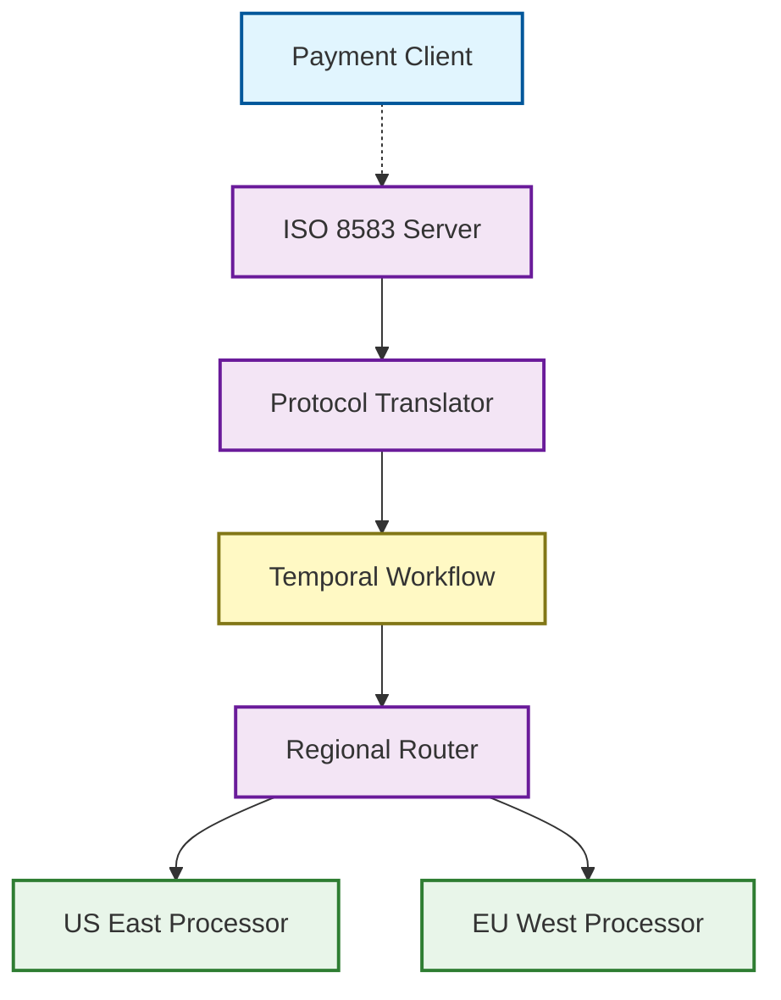
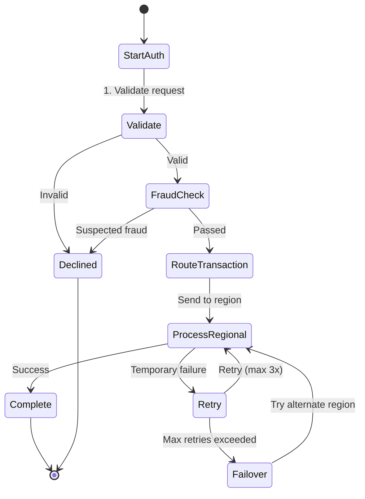
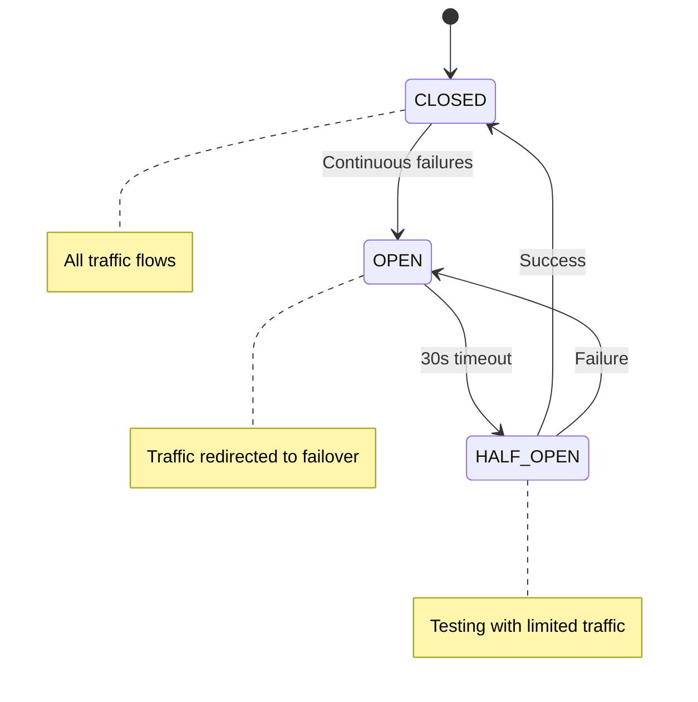

# Reimagining Global Payments

Building a modern transaction router using Go, Temporal, Spanner, and ISO 8583.

The first time this stranger messaged me on LinkedIn, they asked a question about Temporal and Apache Arrow. I had just published an article on Arrow, and their note felt more like a nudge than a request. Still, it stuck in my head. That night, the architecture came to me in a dream. The result was Zero-Copy, Zero-Delay, a system that reimagines how data should move through distributed workflows.

The second time they messaged me, it was with a link.

"Hi Thomas. I enjoy reading your Medium articles. I don't know if this is of interest to you, but ByteByteGo recently published an article on how Amex rebuilt their global transaction router in Go…"

I clicked.

And that was all it took.

I spent seven years at MasterCard, three at Bank of America, and another seven at Wells Fargo. So when I read how American Express drew a line between legacy ISO 8583 and modern gRPC - keeping the outside old while rebuilding the inside - I couldn't look away. I knew exactly what kind of system they were describing.

But I didn't have a dream this time.

I had a challenge. A problem that felt like it belonged to me.

So I built Pulse - a reimagining of modern financial infrastructure, from the protocol level up. Inspired by Amex's architecture, informed by my years in payments, and shaped by hard-won lessons in distributed systems.

This wasn't a dream.

This was a quest.

## The Payment Problem

Financial transactions are unforgiving.

Milliseconds matter. Reliability isn't negotiable. Scale isn't optional.

The banking industry runs on ISO 8583 - a message format created in the 1980s that's become the lingua franca of card payments. It's dense, binary, and rigid. It's also not going anywhere.

Modern payment networks face a fundamental tension:

- They must support legacy protocols and partners.
- They must scale to handle billions of transactions.
- They must process each authorization in milliseconds.
- They must never, ever go down.

This isn't just a technical challenge. It's a business imperative.

Every millisecond of latency costs money. Every percentage point of downtime costs trust. Every failed transaction costs a customer.

The standard approach? Build monolithic systems. Keep it simple. Avoid distributed complexity.

I rejected that premise entirely.

## Protocol Boundaries as First-Class Citizens

Payment systems fail when they blur the lines between protocols, mixing ISO 8583 parsing with business logic, entangling external communication with internal processing.

Instead, I drew hard lines.



At the boundary, a clean separation:

```go
// isoToAuthRequest converts ISO 8583 message to internal protocol buffer
func (r *Router) isoToAuthRequest(message *iso8583.Message) (*proto.AuthRequest, error) {
    // Extract mandatory fields
    mti, err := message.GetString(0)
    if err != nil {
        return nil, err
    }

    pan, err := message.GetString(2)
    if err != nil {
        return nil, fmt.Errorf("failed to get PAN: %w", err)
    }

    amount, err := message.GetString(4)
    if err != nil {
        return nil, fmt.Errorf("failed to get amount: %w", err)
    }

    // Create clean, protocol-agnostic internal representation
    return &proto.AuthRequest{
        Mti:              mti,
        Pan:              pan,
        Amount:           amount,
        TransmissionTime: extractTimestamp(message),
        Stan:             extractStan(message),
    }, nil
}
```

No ISO 8583 details leak beyond this boundary. Every transaction entering the system gets stripped to its essence - transformed from the dense binary format of the 1980s into a clean, typed protocol buffer.

Inside, everything speaks the same language. Outside, we maintain perfect compatibility with legacy systems.

This isn't just an implementation detail. It's an architectural principle.

## Workflow-First Processing

Traditional payment routers handle each message in isolation. Fire-and-forget. One request, one response.

That approach breaks down for complex payment flows: pre-authorizations, installments, recurring billing.

So I rejected it.

Instead, Pulse treats every transaction as a durable workflow, orchestrated by Temporal.



Every workflow persists its state. Every step can be retried. Every transaction is traceable.

```go
// Execute runs the payment authorization workflow
func (w *PaymentWorkflow) Execute(ctx workflow.Context, request *proto.AuthRequest) (*proto.AuthResponse, error) {
    logger := workflow.GetLogger(ctx)
    logger.Info("Starting authorization workflow", "pan_prefix", maskPan(request.Pan))

    // Step 1: Validate the request
    if err := validateRequest(request); err != nil {
        return createDeclineResponse(request, "14"), nil // Invalid request
    }

    // Step 2: Run fraud check with configurable retry policy
    options := workflow.ActivityOptions{
        StartToCloseTimeout: 1 * time.Second,
        RetryPolicy: &temporal.RetryPolicy{
            InitialInterval:    100 * time.Millisecond,
            BackoffCoefficient: 1.5,
            MaximumAttempts:    3,
        },
    }
    
    fraudCtx := workflow.WithActivityOptions(ctx, options)
    var fraudResult bool
    err := workflow.ExecuteActivity(fraudCtx, "CheckFraud", request).Get(fraudCtx, &fraudResult)
    if err != nil {
        logger.Warn("Fraud check failed, proceeding cautiously", "error", err)
    } else if !fraudResult {
        return createDeclineResponse(request, "59"), nil // Suspected fraud
    }

    // Step 3: Route and process the transaction
    regionResult, err := w.routeAndProcess(ctx, request)
    if err != nil {
        return createSystemErrorResponse(request), err
    }

    return regionResult, nil
}
```

This workflow-first approach delivers benefits that traditional request-response systems can't match:

1. **Durability**: Transactions survive process crashes, network blips, and region failures.
2. **Visibility**: Every transaction's path is fully traceable through the system.
3. **Consistency**: Failed steps are automatically retried without developer effort.
4. **Complexity Management**: Multi-stage flows become explicit and maintainable.

## Bulletproof Routing with Circuit Breakers

Payment systems fail. Regions go down. Latency spikes occur.

The difference between good and great systems is how they handle these failures.

Pulse implements sophisticated geographic routing based on card BIN (Bank Identification Number) ranges, with automatic failover between regions managed by circuit breakers:



When a circuit "opens" due to consecutive failures, traffic automatically reroutes:

```go
// Check if the primary region is healthy
r.healthMutex.RLock()
regionHealth, ok := r.regionHealth[primaryRegion]
primaryHealthy := ok && regionHealth.IsHealthy()
r.healthMutex.RUnlock()

// Use primary or failover region
targetRegion := primaryRegion
if !primaryHealthy {
    if failoverRegion, ok := r.config.FailoverMap[primaryRegion]; ok {
        r.healthMutex.RLock()
        failoverHealth, exists := r.regionHealth[failoverRegion]
        failoverHealthy := exists && failoverHealth.IsHealthy()
        r.healthMutex.RUnlock()

        if failoverHealthy {
            log.Printf("Failing over from %s to %s for transaction %s", 
                      primaryRegion, failoverRegion, request.Stan)
            targetRegion = failoverRegion
            request.Region = failoverRegion
        }
    }
}
```

This isn't just a backup system. It's a self-healing router that automatically detects problems and reroutes traffic without human intervention.

## Real-Time Fraud Detection Built In

Fraud is an existential threat to payment systems. The stakes are too high for bolt-on solutions.

So I built fraud detection directly into the core, using a multi-layered approach:

```go
// Analyze performs fraud analysis on a transaction
func (f *SimpleFraudAnalyzer) Analyze(request *proto.AuthRequest) (bool, string, error) {
    // Extract card BIN
    cardBin := ""
    if len(request.Pan) >= 6 {
        cardBin = request.Pan[:6]
    }

    // Parse amount
    amount, err := strconv.ParseFloat(strings.TrimSpace(request.Amount), 64)
    if err != nil {
        return false, "Invalid amount format", err
    }

    // Layer 1: High-risk BIN check
    for _, highRiskBin := range f.highRiskBins {
        if cardBin == highRiskBin && amount > f.amountThreshold/2 {
            return false, fmt.Sprintf("High-risk BIN %s with amount $%.2f", 
                                     maskBin(cardBin), amount), nil
        }
    }

    // Layer 2: Velocity check (multiple transactions in short time)
    if f.checkVelocity(request.Pan) {
        return false, fmt.Sprintf("Velocity check failed: too many transactions for PAN %s", 
                                 maskPAN(request.Pan)), nil
    }

    // Layer 3: Amount threshold check
    if amount > f.amountThreshold {
        // Allow but flag for additional verification
        return true, fmt.Sprintf("High amount $%.2f requires additional verification", 
                                amount), nil
    }

    return true, "Transaction passed all fraud checks", nil
}
```

The fraud detection system includes:

1. **BIN Risk Analysis**: Identifies high-risk card ranges
2. **Velocity Checks**: Detects unusual transaction frequency
3. **Amount Thresholds**: Flags suspiciously large transactions
4. **Pattern Recognition**: Identifies known fraud signatures

All of this runs in real-time, within the transaction flow, with minimal latency impact.

## Global Storage with Zero Compromise

Traditional payment systems face a impossible choice: latency or consistency. You can't have both.

I rejected that premise too.

Using Google Cloud Spanner for globally consistent storage, Pulse achieves both low latency and strong consistency:

```go
// Store implements storage.Storage for Spanner
type Store struct {
    client         *spanner.Client
    databaseString string
    writeLatency   *prometheus.HistogramVec
    readLatency    *prometheus.HistogramVec
    errorCount     *prometheus.CounterVec
}

// SaveAuthorization persists a transaction asynchronously
func (s *Store) SaveAuthorization(ctx context.Context, auth *proto.AuthRequest, 
                                 region string, approved bool) error {
    // Start timing
    start := time.Now()
    defer func() {
        s.writeLatency.WithLabelValues("save_authorization").Observe(time.Since(start).Seconds())
    }()

    // Create mutation
    mutation := spanner.InsertOrUpdate("Authorizations", 
        []string{"Stan", "Pan", "Amount", "Region", "Approved", "TransmissionTime", "InsertedAt"},
        []interface{}{
            auth.Stan, auth.Pan, auth.Amount, region, approved,
            auth.TransmissionTime, spanner.CommitTimestamp,
        })

    // Apply mutation
    _, err := s.client.Apply(ctx, []*spanner.Mutation{mutation})
    if err != nil {
        s.errorCount.WithLabelValues("save_authorization", getErrorType(err)).Inc()
        return fmt.Errorf("failed to save authorization: %w", err)
    }

    return nil
}
```

Key insight: transactions don't need to wait for storage. By persisting asynchronously but reading synchronously, we get the best of both worlds - ultra-low latency for the critical path, with guaranteed durability for auditing and analytics.

## Go: The Bedrock of Modern Financial Infrastructure

I built Pulse in Go for a reason. Several reasons, actually:

1. **Goroutines for Concurrency**: Handling thousands of TCP connections without thread overhead.
2. **Fast Startup**: No JVM warm-up period means consistent performance from the first transaction.
3. **Predictable GC**: Low pause times for consistent latency, even under load.
4. **Native Compilation**: Simple deployment without runtime dependencies.
5. **Type Safety with Simplicity**: Catching errors at compile time without verbose boilerplate.

Go's combination of performance, simplicity, and safety makes it ideal for financial infrastructure. The language gets out of the way, letting you focus on the problem domain rather than fighting the runtime.

## The Results: Performance Under Pressure

Pulse isn't just theory. It's built to perform.

Under load testing, the system delivers:

- **99th percentile latency under 20ms**: Even at peak loads, transactions complete in milliseconds.
- **Horizontal scalability**: Linear performance scaling with additional nodes.
- **Zero downtime upgrades**: Rolling deployments without dropping connections.
- **Automatic failover**: Seamless recovery from regional outages.
- **Complete transaction tracing**: Every step of every transaction is trackable.

These aren't just numbers. They're the difference between a payment system that works and one that excels.

## Beyond Transactions: What's Next

Pulse is just the beginning. The architecture opens new possibilities that traditional payment systems can't touch:

### 1. Machine Learning Integration

The current fraud detection system uses rule-based logic, but the real power comes from integrating ML:

```go
// Future architecture for ML-based fraud detection
type MLFraudAnalyzer struct {
    modelClient *tensorflow.SavedModelClient
    featureExtractor *FeatureExtractor
    scoreThreshold float32
}

func (m *MLFraudAnalyzer) Analyze(ctx context.Context, req *proto.AuthRequest) (bool, string, error) {
    // Extract features from request
    features := m.featureExtractor.Extract(req)
    
    // Run inference
    results, err := m.modelClient.Predict(ctx, features)
    if err != nil {
        return false, "", fmt.Errorf("model prediction failed: %w", err)
    }
    
    // Parse results
    fraudScore := results.GetFloatVal("fraud_probability")
    
    // Apply threshold
    if fraudScore > m.scoreThreshold {
        return false, fmt.Sprintf("ML fraud score too high: %.2f", fraudScore), nil
    }
    
    return true, fmt.Sprintf("ML fraud score: %.2f", fraudScore), nil
}
```

### 2. Cross-Border Payment Optimization

The next frontier is optimizing cross-border payments with intelligent routing:

```go
func (r *Router) optimizeCrossBorderRoute(request *proto.AuthRequest) (string, error) {
    // Parse currency code from request
    currency := extractCurrency(request)
    if currency == "" {
        return r.determineRegion(request.Pan), nil
    }
    
    // If transaction currency doesn't match card's home currency, find optimal route
    cardRegion := r.determineRegion(request.Pan)
    cardCurrency := r.regionToCurrency[cardRegion]
    
    if currency != cardCurrency {
        // Find region with best FX rate for this currency pair
        bestRegion, bestRate := r.findBestFxRate(cardCurrency, currency)
        return bestRegion, nil
    }
    
    return cardRegion, nil
}
```

### 3. Event-Sourced Architecture

The ultimate evolution is moving to a complete event-sourced architecture:

```go
// Event represents a transaction event
type Event struct {
    ID string
    Type string
    Timestamp time.Time
    PayloadJSON string
    TransactionID string
    Version int
}

// Apply an event to a transaction
func (t *Transaction) Apply(event *Event) error {
    switch event.Type {
    case "transaction_initiated":
        var payload InitiatedPayload
        if err := json.Unmarshal([]byte(event.PayloadJSON), &payload); err != nil {
            return err
        }
        t.Status = "PENDING"
        t.Amount = payload.Amount
        t.Pan = payload.Pan
        // ...
    
    case "fraud_check_passed":
        t.FraudCheckStatus = "PASSED"
        
    case "authorization_approved":
        t.Status = "APPROVED"
        // ...
    }
    
    t.Version = event.Version
    return nil
}
```

## The Hard-Won Lessons

Building Pulse taught me lessons that go beyond code:

### 1. Protocol Boundaries Change Everything

By drawing clear lines between protocols, we gain flexibility without sacrificing compatibility. This isn't just about payments - it's a pattern for modernizing any system with legacy constraints.

### 2. Workflows Beat Transactions

The shift from transaction-oriented to workflow-oriented thinking transforms reliability. When every step is durable and retryable, systems become inherently robust.

### 3. Distributed Systems Can Be Simple

With the right abstractions, distributed systems don't have to be complex. Temporal handles the hard parts of distribution, letting developers focus on business logic.

### 4. Go Fits Financial Infrastructure

Go's performance characteristics align perfectly with the demands of financial systems. The result is code that's both reliable and maintainable.

## The Quest Continues

Pulse isn't finished. It's evolving.

The next steps include:

1. **Enhanced Machine Learning**: Real-time fraud models with continuous training
2. **Multi-Protocol Support**: Adding ISO 20022, REST, and GraphQL interfaces
3. **Event Sourcing**: Complete transaction history with perfect auditability
4. **Cross-Region Optimization**: Advanced routing based on latency, cost, and FX rates

This isn't just a project. It's a vision for what financial infrastructure can be - resilient, scalable, and forward-looking while respecting the constraints of the past.

The old and new, working in harmony. Legacy protocols with modern internals. TCP sockets carrying ISO 8583 messages, backed by Temporal workflows and Spanner's global consistency.

Sometimes, the most innovative systems aren't the ones that throw everything away. They're the ones that bridge worlds, connecting what works with what's possible.

That's Pulse.

That's the quest.
