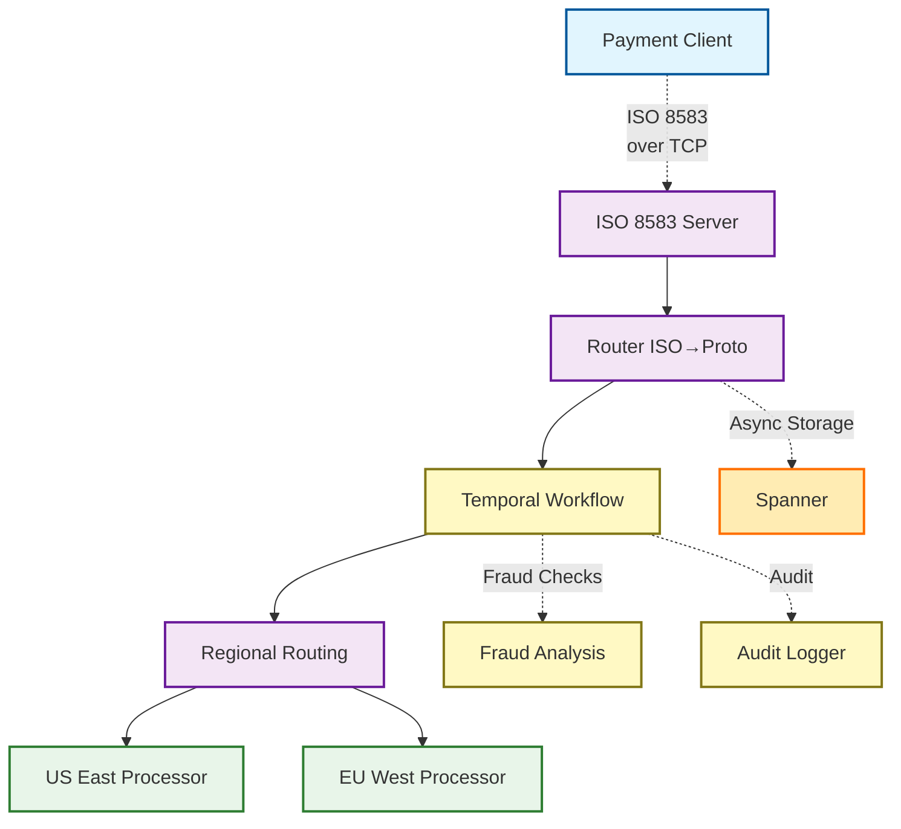
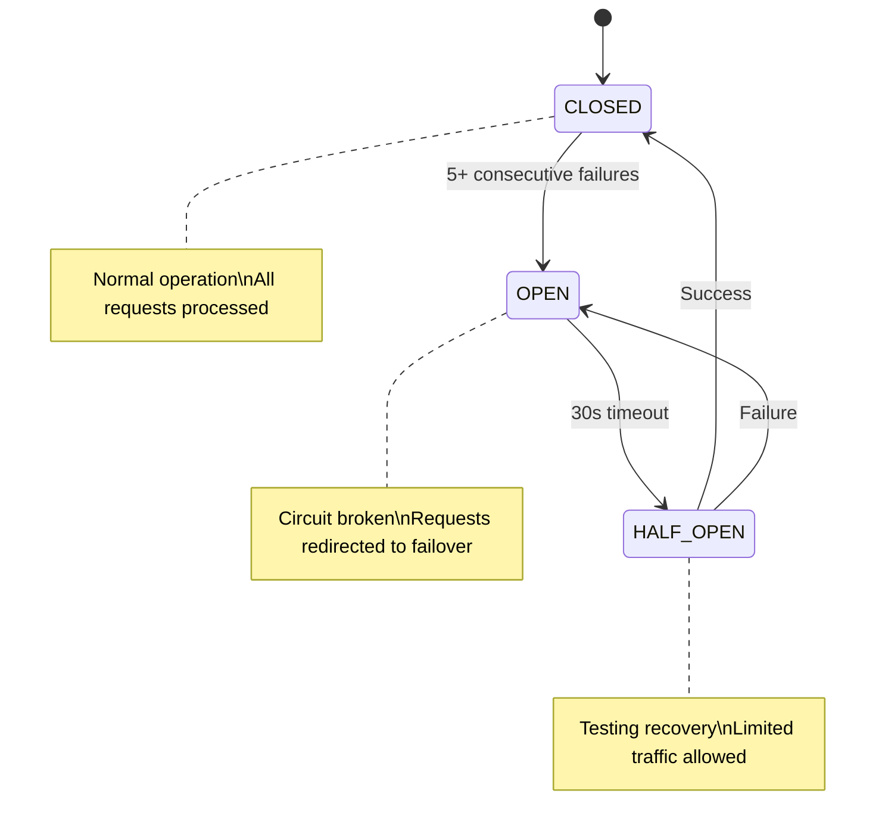
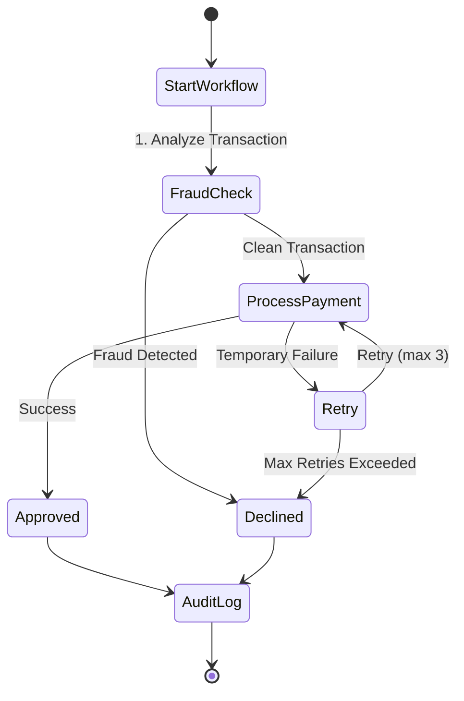

# From Legacy to Innovation: Reimagining Payment Infrastructure with Pulse

How do you build a modern payment routing system while respecting the constraints of decades-old financial protocols? This was the challenge I set for myself when creating **Pulse**, an open-source payment transaction router designed for modern cloud environments while maintaining compatibility with traditional banking systems.

Rather than reverse-engineering existing systems, I wanted to create something that honored the lessons of established payment networks while incorporating cutting-edge architectural patterns. The result is a system that bridges the gap between legacy and innovation—demonstrating how financial technology can evolve without breaking compatibility.

## The Payment Industry's Technical Challenges

Financial transaction processing presents unique engineering challenges:

1. **Ultra-Low Latency Requirements**: Card authorizations must complete in milliseconds—consumers and merchants won't tolerate delays.
2. **Five-Nines Reliability**: Payment systems must achieve 99.999% uptime, as even brief outages can cost millions.
3. **Legacy Protocol Compatibility**: The financial industry relies on ISO 8583, a message standard from the 1980s that remains the backbone of card transactions worldwide.
4. **Variable Traffic Patterns**: Systems must handle enormous traffic spikes during events like Black Friday while remaining cost-effective during slower periods.
5. **Global Distribution**: Modern payment networks must route transactions optimally across continents while maintaining consistent behavior.

Major card networks tackle these challenges with sophisticated architectures combining high-throughput message processing, geographic distribution, and fault tolerance. While the implementation details of these systems are proprietary, their architectural patterns provide valuable inspiration.

## Pulse: Inspired by Industry, Designed for the Cloud

Pulse draws inspiration from modern payment networks while embracing cloud-native principles and adding my own architectural innovations. Here's how it compares to traditional payment systems and where it introduces unique features:



### Key Design Principles

#### 1. Protocol Boundaries as First-Class Concerns

While traditional payment systems often blend protocols throughout their codebase, Pulse establishes clear boundaries between different communication formats:

```go
// isoToAuthRequest converts an ISO8583 message to an AuthRequest
func (r *Router) isoToAuthRequest(message *iso8583.Message) (*proto.AuthRequest, error) {
    mti, err := message.GetString(0)
    if err != nil {
        return nil, err
    }

    // Retrieve required fields
    pan, err := message.GetString(2)
    if err != nil {
        return nil, fmt.Errorf("failed to get PAN: %w", err)
    }

    amount, err := message.GetString(4)
    if err != nil {
        return nil, fmt.Errorf("failed to get amount: %w", err)
    }

    transmissionTime, err := message.GetString(7)
    if err != nil {
        return nil, fmt.Errorf("failed to get transmission time: %w", err)
    }

    stan, err := message.GetString(11)
    if err != nil {
        return nil, fmt.Errorf("failed to get STAN: %w", err)
    }

    return &proto.AuthRequest{
        Mti:              mti,
        Pan:              pan,
        Amount:           amount,
        TransmissionTime: transmissionTime,
        Stan:             stan,
    }, nil
}
```

This clean separation between the ISO 8583 external interface and internal protocol buffers makes the system more maintainable, testable, and adaptable to future protocol changes.

#### 2. Multi-Region Routing with Smart Failover

Pulse implements sophisticated geographic routing based on card BIN (Bank Identification Number) ranges, with automatic failover between regions:

```go
// determineRegion determines the appropriate region based on the PAN's BIN
func (r *Router) determineRegion(pan string) string {
    if len(pan) < 6 {
        return r.config.DefaultRegion
    }

    bin := pan[:6]

    for binRange, region := range r.config.BinRoutes {
        // Check if the range is a simple prefix match
        if !strings.Contains(binRange, "-") {
            if strings.HasPrefix(bin, binRange) {
                return region
            }
            continue
        }

        // Parse the range
        parts := strings.Split(binRange, "-")
        if len(parts) != 2 {
            continue
        }

        start, err1 := strconv.Atoi(parts[0])
        end, err2 := strconv.Atoi(parts[1])

        if err1 != nil || err2 != nil {
            continue
        }

        binInt, err := strconv.Atoi(bin[:len(parts[0])])
        if err != nil {
            continue
        }

        if binInt >= start && binInt <= end {
            return region
        }
    }

    return r.config.DefaultRegion
}
```

This routing can be configured through a simple YAML file:

```yaml
bin_routes:
  "4": "us_east"       # Visa cards to US East
  "51": "eu_west"      # European Mastercard to EU West
  "34": "us_east"      # Amex to US East
  "35": "eu_west"      # JCB to EU West
  "400000-499999": "us_east"  # Range example
```

#### 3. Circuit Breakers for Regional Health

Pulse includes a sophisticated circuit-breaker implementation that monitors regional health and automatically redirects traffic when issues are detected:



When a circuit "opens" due to consecutive failures, traffic is automatically rerouted to a healthy region:

```go
// Check if the primary region is healthy
r.healthMutex.RLock()
regionHealth, ok := r.regionHealth[primaryRegion]
primaryHealthy := ok && regionHealth.IsHealthy()
r.healthMutex.RUnlock()

// Determine which region to use (primary or failover)
targetRegion := primaryRegion
if !primaryHealthy {
    // Try to use a failover region
    if failoverRegion, ok := r.config.FailoverMap[primaryRegion]; ok {
        r.healthMutex.RLock()
        failoverHealth, exists := r.regionHealth[failoverRegion]
        failoverHealthy := exists && failoverHealth.IsHealthy()
        r.healthMutex.RUnlock()

        if failoverHealthy {
            log.Printf("Failing over from %s to %s for transaction %s", 
                primaryRegion, failoverRegion, authRequest.Stan)
            targetRegion = failoverRegion
            authRequest.Region = failoverRegion
        }
    }
}
```

## Key Innovations in Pulse

While drawing inspiration from established payment networks, Pulse introduces several unique innovations:

### 1. Workflow Orchestration with Temporal

Unlike traditional payment routers that process transactions in a stateless manner, Pulse integrates [Temporal](https://temporal.io/) for durable, fault-tolerant workflow orchestration:



This workflow-based approach enables:

- **Complex Multi-Step Transactions**: Beyond simple authorizations, Pulse can orchestrate complex payment flows that span multiple services.
- **Durable Execution**: Workflows persist their state, allowing transactions to survive process crashes and continue execution from the point of failure.
- **Transparent Retries**: Failed operations are automatically retried with configurable backoff.

The implementation leverages Temporal's programming model:

```go
// Execute runs the payment transaction workflow
func (w *PaymentWorkflow) Execute(ctx workflow.Context, request *proto.AuthRequest) (*proto.AuthResponse, error) {
    logger := workflow.GetLogger(ctx)
    logger.Info("Starting transaction workflow", "stan", request.Stan, "pan_prefix", request.Pan[:6])

    // Setup workflow options
    options := w.defaultOptions
    retryPolicy := &temporal.RetryPolicy{
        InitialInterval:    options.RetryInterval,
        BackoffCoefficient: 1.5,
        MaximumInterval:    options.RetryInterval * 10,
        MaximumAttempts:    int32(options.MaxRetries),
    }

    // Step 1: Run fraud check if enabled
    if options.EnableFraudCheck {
        var fraudCheckResult bool
        fraudCheckCtx := workflow.WithActivityOptions(ctx, workflow.ActivityOptions{
            StartToCloseTimeout: options.FraudCheckTimeout,
            RetryPolicy:         retryPolicy,
        })

        logger.Info("Executing fraud check activity", "stan", request.Stan)
        err := workflow.ExecuteActivity(fraudCheckCtx, "CheckTransaction", request).Get(ctx, &fraudCheckResult)
        if err != nil {
            logger.Error("Fraud check failed", "error", err)
            // Continue with the transaction but flag that fraud check failed
        } else if !fraudCheckResult {
            logger.Info("Transaction rejected by fraud check", "stan", request.Stan)
            // Create a declined response for fraud
            response := &proto.AuthResponse{
                Mti:              getResponseMTI(request.Mti),
                ResponseCode:     "59", // Fraud suspicion response code
            }
            return response, nil
        }
    }

    // Step 2: Process the authorization with retries
    var response *proto.AuthResponse
    authCtx := workflow.WithActivityOptions(ctx, workflow.ActivityOptions{
        StartToCloseTimeout: 10 * time.Second,
        RetryPolicy:         retryPolicy,
    })

    // ... additional workflow logic ...

    return response, nil
}
```

### 2. Real-Time Fraud Detection

Pulse includes a built-in fraud detection system that analyzes transactions in real-time:

```go
// Analyze performs fraud analysis on a transaction request
func (f *SimpleFraudAnalyzer) Analyze(request *proto.AuthRequest) (bool, string, error) {
    // Extract PAN prefix (BIN)
    cardBin := ""
    if len(request.Pan) >= 6 {
        cardBin = request.Pan[:6]
    }

    // Parse amount
    amountStr := strings.TrimSpace(request.Amount)
    amount, err := strconv.ParseFloat(amountStr, 64)
    if err != nil {
        return false, "Invalid amount format", err
    }

    // Check if BIN is in high-risk list
    for _, highRiskBin := range f.highRiskBins {
        if cardBin == highRiskBin && amount > f.amountThreshold/2 {
            reason := fmt.Sprintf("High-risk BIN %s with amount $%.2f", maskBin(cardBin), amount)
            return false, reason, nil
        }
    }

    // Check for high amount
    if amount > f.amountThreshold {
        // Allow, but with a note
        reason := fmt.Sprintf("High amount $%.2f requires additional verification", amount)
        return true, reason, nil
    }

    // Check velocity (multiple transactions in short time)
    if f.checkVelocity(request.Pan) {
        reason := fmt.Sprintf("Velocity check failed: too many transactions for PAN %s", maskPAN(request.Pan))
        return false, reason, nil
    }

    // No fraud detected
    return true, "Transaction passed fraud checks", nil
}
```

This fraud detection system includes:

1. **BIN Risk Analysis**: Risk assessment based on card BIN ranges
2. **Velocity Checks**: Detection of unusual transaction frequency
3. **Amount Thresholds**: Flagging of high-value transactions
4. **Configurable Rules**: Extensible rules engine for custom checks

### 3. Comprehensive Observability

Pulse implements a modern observability stack using Prometheus metrics, comprehensive logging, and detailed tracing:

```go
// Metrics holds all the Prometheus metrics for the application
type Metrics struct {
    RequestCount       *prometheus.CounterVec
    ResponseLatency    *prometheus.HistogramVec
    ErrorCount         *prometheus.CounterVec
    RegionHealthStatus *prometheus.GaugeVec
    WorkflowLatency    *prometheus.HistogramVec
    FraudCheckResults  *prometheus.CounterVec
}
```

This observability model provides real-time insights into:

- Transaction volume by region, type, and response code
- Response latency distributions
- Error rates and types
- Regional health status
- Workflow execution times
- Fraud check results

### 4. Cloud-Native Storage with Spanner

Pulse integrates with Google Cloud Spanner for globally consistent transaction storage:

```go
// Store implements storage.Storage interface for Spanner
type Store struct {
    client         *spanner.Client
    databaseString string
    writeLatency   *prometheus.HistogramVec
    readLatency    *prometheus.HistogramVec
    errorCount     *prometheus.CounterVec
}
```

Unlike traditional payment systems that often use custom replication solutions, Pulse leverages Spanner's global consistency to simplify the architecture while maintaining strong transactional guarantees.

## Lessons from Building Pulse

Developing Pulse taught me several valuable lessons about modern financial infrastructure:

### 1. Protocol Translation as a Design Pattern

The clean separation between ISO 8583 externally and Protocol Buffers internally proved to be a powerful architectural pattern. By establishing this boundary, Pulse can evolve its internal architecture without breaking external compatibility.

This pattern applies beyond payments to any system with legacy external interfaces but modern internal needs:

- **Healthcare systems** dealing with HL7 or DICOM protocols
- **Telecommunications** working with SS7 and other telecom standards
- **EDI and B2B** integration platforms
- **IoT systems** supporting multiple device protocols

### 2. Workflow-First Architecture

The integration of Temporal for workflow orchestration transformed how transactions are processed. Instead of treating each message as an isolated event, Pulse models transactions as workflows with multiple steps, retry logic, and durable state.

This approach simplifies handling complex scenarios like:

- **Two-phase authorizations** (pre-auth and completion)
- **Retries with exponential backoff**
- **Cross-service coordination**
- **Long-running payment processes**

### 3. Balancing Legacy and Innovation

Building Pulse required a careful balance between compatibility with legacy protocols and adoption of modern architectural patterns. The key insight was identifying where to draw the boundaries between old and new.

This principle extends beyond payment systems to any modernization effort:

1. **Identify the essential interfaces** that must remain compatible
2. **Establish clean translation layers** at those boundaries
3. **Modernize everything behind those boundaries**
4. **Add new capabilities** that enhance but don't break compatibility

### 4. Go as an Ideal Language for Financial Infrastructure

Go proved to be an excellent choice for building Pulse, offering:

- **Goroutines for concurrency**: Handling thousands of connections efficiently
- **Low-latency garbage collection**: Minimizing pause times for consistent performance
- **Compiled performance**: Fast startup and predictable execution
- **Strong type safety**: Preventing common runtime errors
- **Simplicity**: Making the codebase approachable and maintainable

These characteristics make Go particularly well-suited for financial systems that require both performance and reliability.

## Future Directions

While Pulse already implements many advanced features, several exciting enhancements are planned:

1. **Expanded Workflow Patterns**: Additional workflow templates for common payment scenarios like installments, subscriptions, and multi-currency transactions.

2. **Enhanced Fraud Models**: Integration with machine learning-based fraud detection, allowing real-time model updates and more sophisticated risk scoring.

3. **Multi-Protocol Support**: Adding support for ISO 20022, REST APIs, and other emerging payment protocols while maintaining the same internal architecture.

4. **Event Sourcing**: Implementing an event sourcing pattern for complete transaction history and audit capabilities.

5. **Cross-Region Optimization**: Advanced routing algorithms that consider network latency, regional load, and cost optimization.

## Conclusion: Innovation Within Constraints

Building Pulse demonstrated that it's possible to create innovative, cloud-native financial infrastructure while respecting the constraints of established protocols and practices. Rather than viewing legacy compatibility as a limitation, it can be seen as a design parameter that focuses innovation where it matters most.

For fintech builders and infrastructure engineers, Pulse offers both a practical tool and an architectural blueprint—showing how to combine proven patterns from industry leaders with modern cloud-native approaches to create systems that are both backward-compatible and forward-looking.

The future of financial infrastructure isn't about replacing existing protocols—it's about building smarter, more resilient systems around them. By drawing inspiration from established patterns while embracing modern architectural principles, we can create payment systems that honor the past while enabling the future.
