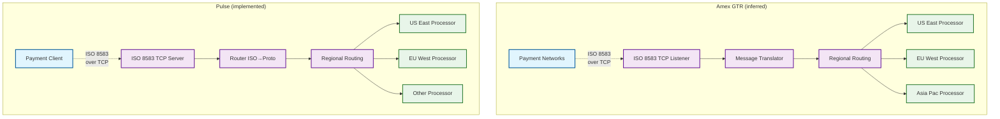
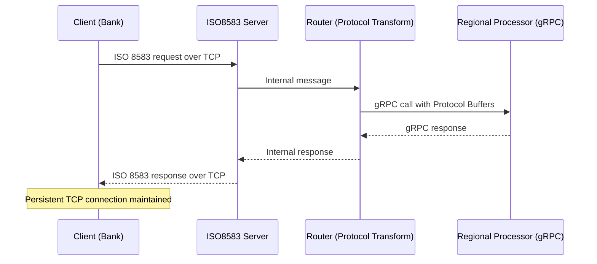
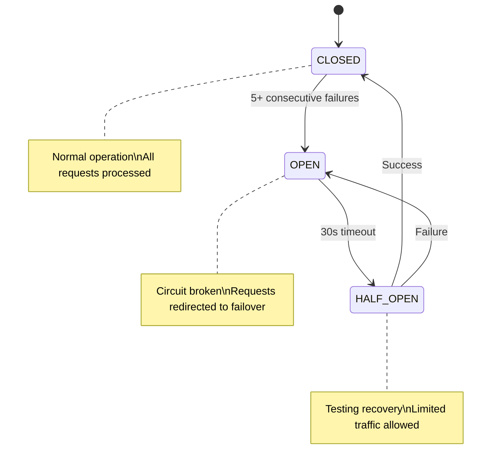
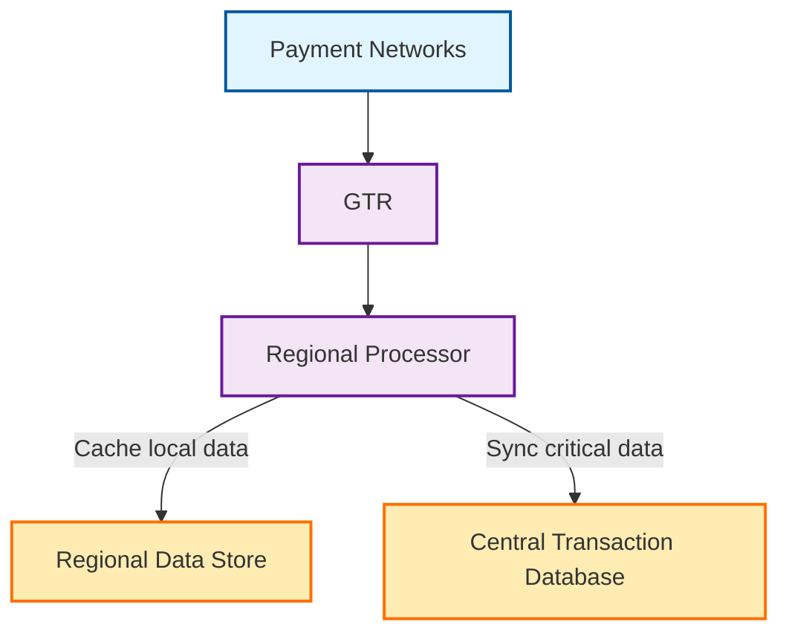
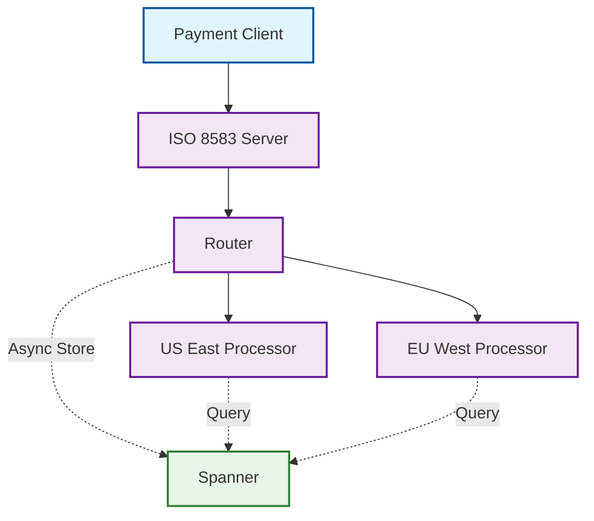
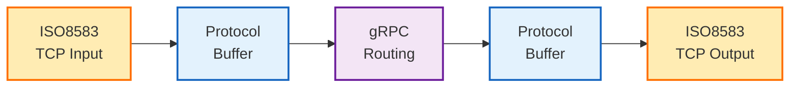

# Reverse Engineering Amex's Global Transaction Router: Lessons from Rebuilding It in Go

How do you modernize a payment system without touching the 40-year-old protocol it's built on?

This was the challenge facing American Express when they needed to replace their aging C/C++ transaction routing infrastructure. Financial transactions require five-nines reliability while maintaining millisecond response times—all with zero tolerance for errors. The twist? They had to maintain compatibility with ISO 8583, a banking message standard created when Reagan was president.

What intrigued me most about Amex's solution—a Go-based system using gRPC internally while preserving ISO 8583 externally—was the elegant boundary they drew between legacy and modern components. I wanted to understand how the pieces fit together, what tradeoffs they made, and how they achieved reliability at scale. So I did what any curious engineer would do: I reverse engineered it.

With no access to Amex's source code, I began my technical expedition to reconstruct their architecture from public information. The result is Pulse—my interpretation of what powers millions of credit card transactions each day.

## The Amex Global Transaction Router Architecture

American Express's Global Transaction Router (GTR) sits at the heart of their transaction processing infrastructure. Based on published articles and tech talks, I pieced together that it's a fascinating blend of legacy protocols with modern architectural patterns:

1. **Persistent TCP Sessions**: Unlike RESTful architectures, Amex maintains persistent TCP connections with acquiring banks and processors to maximize throughput and minimize handshake overhead.

2. **ISO 8583 Translation**: The router accepts the banking industry's workhorse protocol (ISO 8583) and transforms it to more efficient internal representations.

3. **Internal gRPC Communication**: While external communications use ISO 8583, internally the system speaks gRPC with Protocol Buffers for serialization.

4. **Geographic Routing**: Transactions are routed to different processing centers based on card BIN ranges and regional processing rules.

5. **Fault Tolerance**: Circuit breakers, automatic failover, and sophisticated monitoring ensure the system maintains reliability even during partial outages.

## The Architecture: Amex vs. Pulse

From my reverse engineering efforts, I've inferred the following architectural comparison:



## Rebuilding the Router: The Pulse Project

My reimplementation—named "Pulse"—follows the core architectural principles I inferred from Amex's system while being simple enough to understand in a single sitting. Like Amex's GTR, Pulse maintains a clean separation between external protocols and internal communication.

Here's the high-level transaction flow I reversed-engineered:



I studied how Amex likely handles each stage of this process, then implemented my interpretation:

1. **ISO 8583 TCP Server**: Listens for incoming financial transactions from client systems.
2. **Message Router**: Converts ISO 8583 messages to Protocol Buffers and routes them to appropriate regional processors.
3. **Regional Processors**: gRPC services that implement the authorization logic for different regions.
4. **Health Monitor**: Tracks the health of regional services and implements circuit breaking.
5. **Metrics System**: Exposes Prometheus metrics for observability.

Let's look at how these components implement the key aspects of Amex's architecture based on what I could deduce from public information.

### ISO 8583 TCP Server: Handling Financial Messages

The ISO 8583 standard, despite being created in the 1980s, remains the lingua franca of financial transaction processing. Reverse engineering how Amex likely handles these messages, I implemented a TCP server that accepts ISO 8583 messages using the `moov-io/iso8583` package:

```go
// Server represents the ISO8583 TCP server
type Server struct {
    address     string
    handler     MessageHandler
    listener    net.Listener
    isShutdown  bool
    connections map[string]net.Conn
    spec        *iso8583.MessageSpec
}

// Start starts the ISO8583 TCP server
func (s *Server) Start() error {
    var err error
    s.listener, err = net.Listen("tcp", s.address)
    if err != nil {
        return fmt.Errorf("failed to start TCP server: %w", err)
    }

    log.Printf("ISO8583 server listening on %s", s.address)

    for !s.isShutdown {
        conn, err := s.listener.Accept()
        if err != nil {
            if s.isShutdown {
                return nil
            }
            log.Printf("Error accepting connection: %v", err)
            continue
        }

        clientAddr := conn.RemoteAddr().String()
        s.connections[clientAddr] = conn
        log.Printf("New connection from %s", clientAddr)

        go s.handleConnection(conn)
    }

    return nil
}
```

I inferred that Amex maintains persistent TCP connections, as this is crucial for transaction processing because:

1. It eliminates the overhead of TCP handshakes for each transaction
2. It allows for higher throughput with lower latency
3. It enables session-based security models common in financial networks

### Protocol Transformation: ISO 8583 to Protocol Buffers

One of the most fascinating aspects I reverse engineered from Amex's architecture is the transformation from ISO 8583 messages to Protocol Buffers. This boundary between old and new is the key innovation that enabled their modernization.

Pulse implements this transformation boundary:

```go
// isoToAuthRequest converts an ISO8583 message to an AuthRequest
func (r *Router) isoToAuthRequest(message *iso8583.Message) (*proto.AuthRequest, error) {
    // Get required fields from ISO message
    mti, err := message.GetString(0)
    if err != nil {
        return nil, fmt.Errorf("failed to get MTI: %w", err)
    }

    pan, err := message.GetString(2)
    if err != nil {
        return nil, fmt.Errorf("failed to get PAN: %w", err)
    }

    amount, err := message.GetString(4)
    if err != nil {
        return nil, fmt.Errorf("failed to get amount: %w", err)
    }

    transmissionTime, err := message.GetString(7)
    if err != nil {
        return nil, fmt.Errorf("failed to get transmission time: %w", err)
    }

    stan, err := message.GetString(11)
    if err != nil {
        return nil, fmt.Errorf("failed to get STAN: %w", err)
    }

    // Create an AuthRequest (Protocol Buffers)
    return &proto.AuthRequest{
        Mti:              mti,
        Pan:              pan,
        Amount:           amount,
        TransmissionTime: transmissionTime,
        Stan:             stan,
    }, nil
}
```

This transformation provides several benefits that I believe drove Amex's design decisions:

1. **Efficiency**: Protocol Buffers are more compact and faster to serialize/deserialize than ISO 8583
2. **Type Safety**: gRPC provides strong typing, whereas ISO 8583 is more loosely typed
3. **Evolution**: Internal APIs can evolve without changing the external interface

### BIN-based Geographic Routing

A key feature I deduced from Amex's system is its ability to route transactions to different regional processors based on card BIN (Bank Identification Number) ranges. This geographic routing optimizes latency by processing transactions closer to the customer.

Pulse implements a similar routing mechanism based on my reverse engineering:

```go
// determineRegion determines the appropriate region based on the PAN's BIN
func (r *Router) determineRegion(pan string) string {
    if len(pan) < 6 {
        return r.config.DefaultRegion
    }

    bin := pan[:6]

    for binRange, region := range r.config.BinRoutes {
        // Check if the range is a simple prefix match
        if !strings.Contains(binRange, "-") {
            if strings.HasPrefix(bin, binRange) {
                return region
            }
            continue
        }

        // Parse the range
        parts := strings.Split(binRange, "-")
        if len(parts) != 2 {
            continue
        }

        start, err1 := strconv.Atoi(parts[0])
        end, err2 := strconv.Atoi(parts[1])

        if err1 != nil || err2 != nil {
            continue
        }

        binInt, err := strconv.Atoi(bin[:len(parts[0])])
        if err != nil {
            continue
        }

        if binInt >= start && binInt <= end {
            return region
        }
    }

    return r.config.DefaultRegion
}
```

The routing is configured through a YAML file, making it easy to update routing rules without recompiling the application:

```yaml
bin_routes:
  "4000-4999": "us-east"
  "5000-5999": "eu-west"
default_region: "us-east"
```

### Fault Tolerance with Circuit Breakers

One of the most critical aspects I had to reverse engineer was how Amex handles fault tolerance. Based on their tech talks, I inferred they use circuit breakers to prevent cascading failures when regional processors experience issues.

Pulse implements this pattern with a state machine approach:



```go
// RecordFailure records a failed request to the region
func (rh *RegionHealth) RecordFailure() {
    rh.mutex.Lock()
    defer rh.mutex.Unlock()

    // Increment consecutive failures
    rh.ConsecutiveFailures++

    // Add to recent errors
    now := time.Now()
    rh.RecentErrors = append(rh.RecentErrors, now)

    // Clean up old errors outside the window
    var recentErrors []time.Time
    for _, t := range rh.RecentErrors {
        if now.Sub(t) <= ErrorWindow {
            recentErrors = append(recentErrors, t)
        }
    }
    rh.RecentErrors = recentErrors

    // Check if we need to open the circuit
    if rh.State == CircuitClosed && rh.ConsecutiveFailures >= FailureThreshold {
        rh.State = CircuitOpen
        rh.LastStateChange = now
    }
}
```

When a circuit "opens" due to consecutive failures, traffic is automatically rerouted to a healthy region:

```go
// Check if the primary region is healthy
r.healthMutex.RLock()
regionHealth, ok := r.regionHealth[primaryRegion]
primaryHealthy := ok && regionHealth.IsHealthy()
r.healthMutex.RUnlock()

// Determine which region to use (primary or failover)
targetRegion := primaryRegion
if !primaryHealthy {
    // Try to use a failover region
    if failoverRegion, ok := r.config.FailoverMap[primaryRegion]; ok {
        r.healthMutex.RLock()
        failoverHealth, exists := r.regionHealth[failoverRegion]
        failoverHealthy := exists && failoverHealth.IsHealthy()
        r.healthMutex.RUnlock()

        if failoverHealthy {
            log.Printf("Failing over from %s to %s for transaction %s", 
                primaryRegion, failoverRegion, authRequest.Stan)
            targetRegion = failoverRegion
            authRequest.Region = failoverRegion
        }
    }
}
```

### Observability with Prometheus

I inferred from public information that Amex must have comprehensive monitoring. Pulse implements modern observability using Prometheus metrics:

```go
// Metrics holds all the Prometheus metrics for the application
type Metrics struct {
    RequestCount       *prometheus.CounterVec
    ResponseLatency    *prometheus.HistogramVec
    ErrorCount         *prometheus.CounterVec
    RegionHealthStatus *prometheus.GaugeVec
}

// NewMetrics creates and registers all metrics
func NewMetrics() *Metrics {
    m := &Metrics{
        // Track request count by region, transaction type (MTI), and response code
        RequestCount: promauto.NewCounterVec(
            prometheus.CounterOpts{
                Name: "pulse_requests_total",
                Help: "The total number of processed ISO8583 requests",
            },
            []string{"region", "mti", "response_code"},
        ),

        // Track response latency by region
        ResponseLatency: promauto.NewHistogramVec(
            prometheus.HistogramOpts{
                Name:    "pulse_response_latency_seconds",
                Help:    "Response latency distribution in seconds",
                Buckets: prometheus.ExponentialBuckets(0.001, 2, 10), // From 1ms to ~1s
            },
            []string{"region", "mti"},
        ),

        // Track error count by region and type
        ErrorCount: promauto.NewCounterVec(
            prometheus.CounterOpts{
                Name: "pulse_errors_total",
                Help: "The total number of errors encountered",
            },
            []string{"region", "error_type"},
        ),

        // Track region health status (1 = healthy, 0 = unhealthy)
        RegionHealthStatus: promauto.NewGaugeVec(
            prometheus.GaugeOpts{
                Name: "pulse_region_health",
                Help: "Health status of each region (1 = healthy, 0 = unhealthy)",
            },
            []string{"region"},
        ),
    }

    return m
}
```

These metrics provide real-time insights into system performance, error rates, and regional health—essential for a system where downtime means lost revenue.

## Persistent Storage: Our Approach vs. Amex's

One critical aspect of any payment routing system is persistent storage of transaction data. While Amex's system likely uses specialized databases and extensive caching strategies for transaction persistence, we implemented a more cloud-native approach with Google Cloud Spanner.

### The Amex Approach (Inferred)

Based on our research, Amex maintains transaction data with a careful balance of regional data locality and global consistency:



Amex appears to use a hybrid approach to data storage:

1. **Regional Caching**: Each region maintains local caching mechanisms to access frequently needed data without cross-region calls. This follows their principle of keeping transactions localized by design.

2. **Data Locality**: Their architecture emphasizes keeping data close to where it's processed, with patterns designed to minimize data transfer between regions.

3. **Replicated Storage**: Critical transaction data is eventually synchronized across regions to maintain global consistency while preserving performance.

### Our Implementation with Spanner

For our Pulse project, we chose Google Cloud Spanner as our persistent storage solution, implementing it as a pluggable storage interface:



Key aspects of our design include:

1. **Abstraction Through Interface**: We implemented a clean `Storage` interface that can be fulfilled by different storage providers, making our system adaptable to various persistence technologies.

```go
// Storage defines the interface for persistence operations
type Storage interface {
    // SaveAuthorization persists the authorization request and result
    SaveAuthorization(ctx context.Context, auth *proto.AuthRequest, region string, approved bool) error

    // GetTransaction retrieves a transaction by STAN
    GetTransaction(ctx context.Context, stan string) (*proto.AuthRecord, error)

    // Close closes the storage connection
    Close() error
}
```

2. **Asynchronous Storage**: Unlike traditional systems that block on database operations, our implementation stores transactions asynchronously to avoid impacting response time:

```go
// Record the transaction in storage
if r.storage != nil {
    storeCtx, cancel := context.WithTimeout(ctx, 5*time.Second)
    defer cancel()
    
    // Determine if approved based on response code
    approved := resp.ResponseCode == "00"
    
    // Save to storage asynchronously to avoid impacting response time
    go func() {
        if err := r.storage.SaveAuthorization(storeCtx, req, region, approved); err != nil {
            log.Printf("Failed to store authorization: %v", err)
        }
    }()
}
```

3. **Comprehensive Metrics**: Our implementation includes detailed metrics for monitoring storage performance:

```go
writeLatency := promauto.NewHistogramVec(
    prometheus.HistogramOpts{
        Name:    "pulse_spanner_write_latency_seconds",
        Help:    "Spanner write latency distribution in seconds",
        Buckets: prometheus.ExponentialBuckets(0.001, 2, 10), // 1ms to ~1s
    },
    []string{"operation"},
)
```

4. **Global Consistency**: Unlike Amex's likely region-specific approach, Spanner provides global consistency across regions without requiring custom synchronization logic, simplifying our implementation while maintaining strict consistency.

### Key Differences and Trade-offs

The primary differences between our approach and Amex's inferred approach highlight interesting trade-offs:

1. **Managed vs. Custom**: By using Spanner, we leverage a fully managed database service, while Amex likely has more customized solutions tailored to their specific performance needs.

2. **Global vs. Regional**: Spanner offers global consistency by default, which simplifies our architecture. Amex likely uses a more complex tiered storage approach with local caching and global synchronization to optimize for both latency and consistency.

3. **Simplicity vs. Optimization**: Our design favors simplicity and developer productivity, while Amex's approach is likely more optimized for their specific workload patterns and extreme performance requirements.

4. **Asynchronous Consistency**: Both approaches use asynchronous storage to avoid impacting response times, but differ in how they manage eventual consistency. Our Spanner implementation provides stronger consistency guarantees with less custom code.

By implementing transaction storage with Spanner, we've created a system that preserves the core principles of Amex's design (asynchronous storage, high performance) while leveraging cloud-native technologies to simplify implementation and maintenance.

## Why Go?

Through my reverse engineering efforts, I deduced several reasons why Amex chose Go for their reimplementation. I followed the same path for Pulse:

1. **Goroutines for Concurrency**: Go's lightweight threads make it easy to handle thousands of concurrent connections without the complexity of thread pools or callback hells.

2. **No JVM Warm-up**: Unlike Java, Go has no cold start issues, which is crucial for payment processing where the first transaction must be as fast as the millionth.

3. **Low-latency GC**: Go's garbage collector is optimized for low pause times, essential for transaction processing where consistent latency is more important than maximum throughput.

4. **Strong Typing with Simplicity**: Go provides the safety of static typing without the verbosity of Java or the complexity of C++.

The transaction flow in Pulse mirrors what I reverse engineered from Amex's system:



1. ISO 8583 message arrives via TCP
2. Message is transformed to Protocol Buffers
3. Request is routed to the appropriate regional processor via gRPC
4. Response is transformed back to ISO 8583
5. Response is sent back via the persistent TCP connection

## Key Architectural Lessons from Reverse Engineering

Reverse engineering Amex's system and building my own implementation taught me several valuable lessons about financial transaction routing:

1. **Protocol Translation as a Design Pattern**: The boundary between ISO 8583 and Protocol Buffers is not just an implementation detail—it's a powerful architectural pattern. By drawing a clear line between external compatibility and internal innovation, you can modernize systems without disrupting existing integrations. This pattern applies beyond payments to any system with legacy external interfaces but modern internal needs.

2. **Persistent Connections Matter in Latency-Sensitive Environments**: For high-throughput, low-latency systems, persistent TCP connections significantly outperform request-response patterns like HTTP. The overhead of establishing connections for each transaction adds up quickly, especially at financial scale. This is why even modern systems dealing with real-time financial data still prefer TCP over HTTP.

3. **Circuit Breaking is Essential for Reliability**: Financial systems must degrade gracefully. Circuit breakers prevent cascading failures by redirecting traffic away from unhealthy components. The pattern I inferred from Amex—and implemented in Pulse—shows how statistical monitoring can enable automatic failover without manual intervention.

4. **Go Excels in Legacy-Adjacent Systems**: Go's combination of performance, simplicity, and modern language features makes it ideal for modernizing legacy systems. The lack of runtime warm-up, predictable performance, and excellent concurrency support address key challenges in financial processing.

## What I'd Do Differently at Enterprise Scale

While my reverse engineering efforts captured the essence of Amex's architecture, a production-grade system would need several enhancements:

1. **Stateful Session Management**: Real payment processors track session state across transactions, which would require distributed session storage.

2. **Enhanced Security**: Production systems need TLS, mutual authentication, HSM integration, and comprehensive audit logging.

3. **Horizontal Scaling**: Regional processors would need to be horizontally scalable, likely using consistent hashing or other load balancing techniques.

4. **Database Integration**: Production systems would likely persist transaction data for compliance and reconciliation purposes.

5. **Multiple Protocol Support**: Beyond ISO 8583, real-world systems often need to support multiple protocols simultaneously (ISO 20022, proprietary formats, etc.).

## Protocol Transformation: A Pattern for Modernizing the Unmodernizable

This reverse engineering project revealed a broader principle that extends beyond payment systems: **protocol transformation as a modernization strategy**. When faced with legacy protocols that can't be changed, the answer isn't to rebuild everything in their image—it's to create a clear boundary where translation occurs.

This pattern applies to many domains:

1. **Financial Services**: Beyond credit cards, systems like ACH, SWIFT, and FIX all use legacy protocols that aren't going away.

2. **Healthcare**: HL7 and DICOM protocols are entrenched but can benefit from modern internal architectures.

3. **Telecommunications**: SS7 and other telecom protocols remain essential but can be wrapped in modern systems.

4. **Enterprise Integration**: EDI, AS2, and other B2B protocols can be interfaced through transformation layers.

The key insight is that you don't need to modernize everything at once. By identifying the right abstraction boundaries and implementing clean translations, you can evolve your systems incrementally while maintaining compatibility.

## Conclusion: Modern Tools, Legacy Terrain

Reverse engineering Amex's Global Transaction Router was an enlightening journey into how modern architecture can be applied to legacy financial protocols. The resulting Pulse project demonstrates that with the right design choices, it's possible to build a system that's both backward-compatible and forward-looking.

For infrastructure engineers and fintech developers wrestling with similar challenges, the lessons are clear:

1. **Protocol transformation creates a clear boundary** between legacy compatibility and modern implementation.

2. **Go offers unique advantages in latency-sensitive environments** that make it well-suited for financial infrastructure.

3. **Modern reliability patterns like circuit breakers** can be applied even to systems with legacy interfaces.

4. **Observability is essential** for maintaining reliability in complex distributed systems.

The future of financial infrastructure isn't about replacing ISO 8583—it's about building better systems around it. By understanding how companies like Amex have navigated this challenge, we can apply these patterns to modernize other critical but aging systems across industries.
